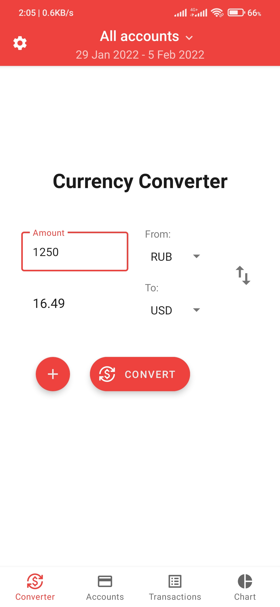
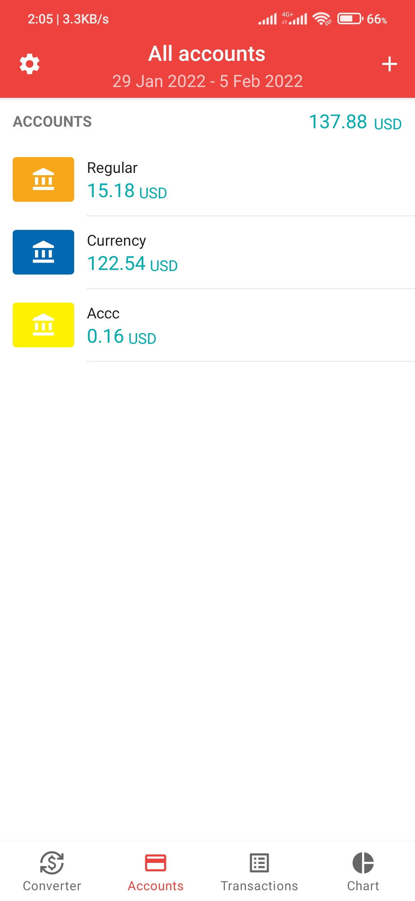
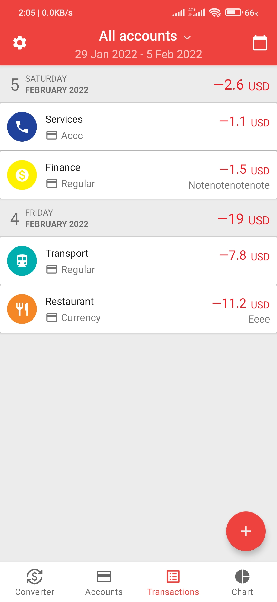
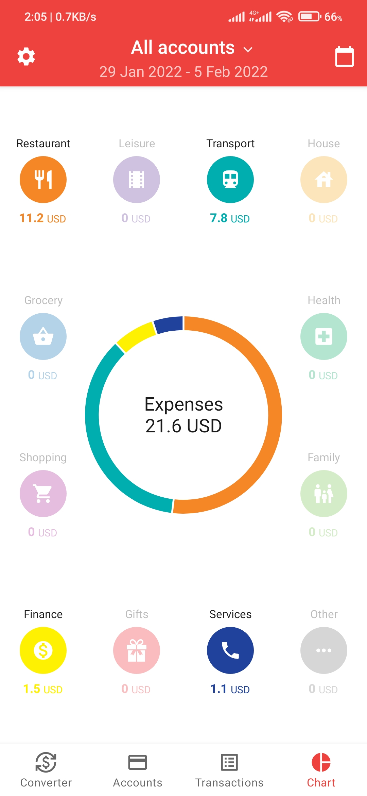
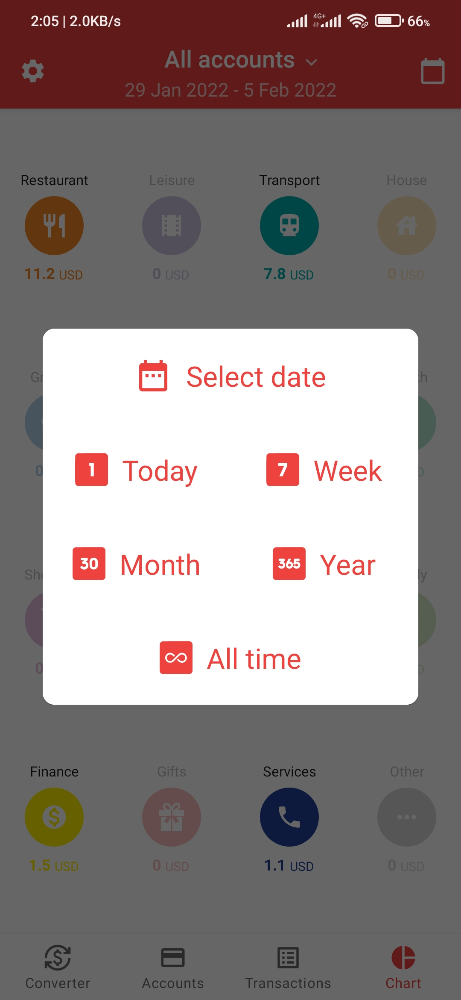
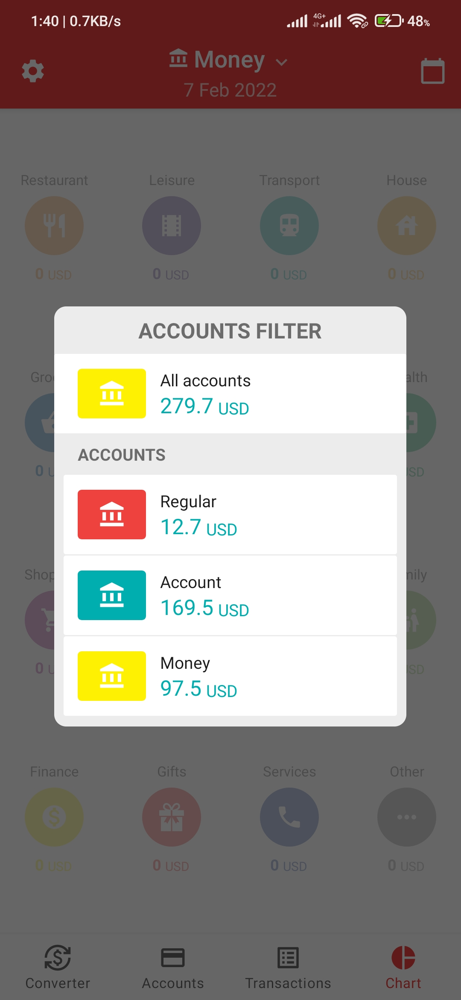
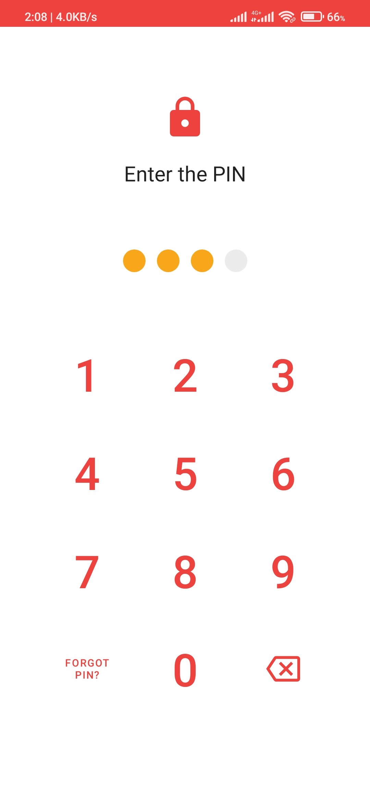
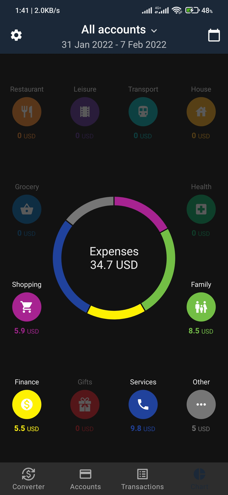
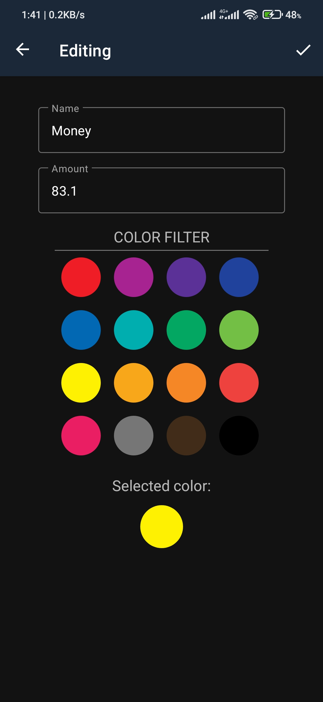

# Money-Manager

### Money Manager is a Android app with a simple and user-friendly interface that allows you to easily and quickly record your expenses.  
In the application, you can do the full work of accounting for your expenses on any number of accounts. It is possible to create, edit and delete accounts, add and delete transactions. You can analyze your expenses both in aggregate and separately for each account and different periods. On one of the screens, transactions are visualized as a pie chart. The application also has a built-in currency converter that works at the current exchange rates. The app has a settings screen where you can change the displayed currency and the theme of the application. For security reasons, you can set a password to log in to the app.

Demo [OLD]: https://youtu.be/nAOsTzzfSGY

## Images
            
